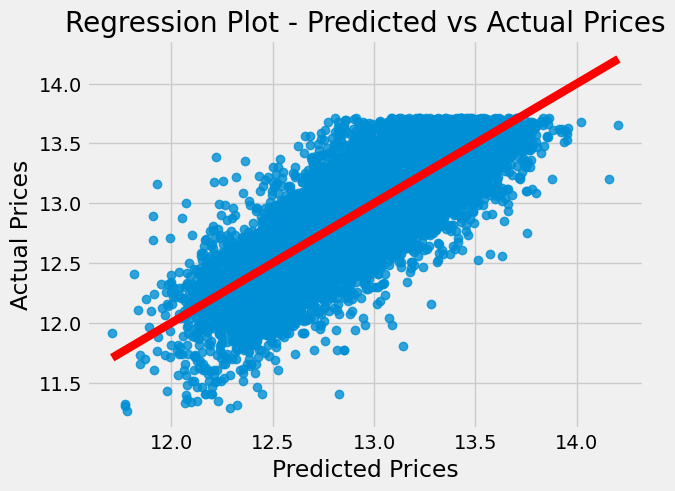
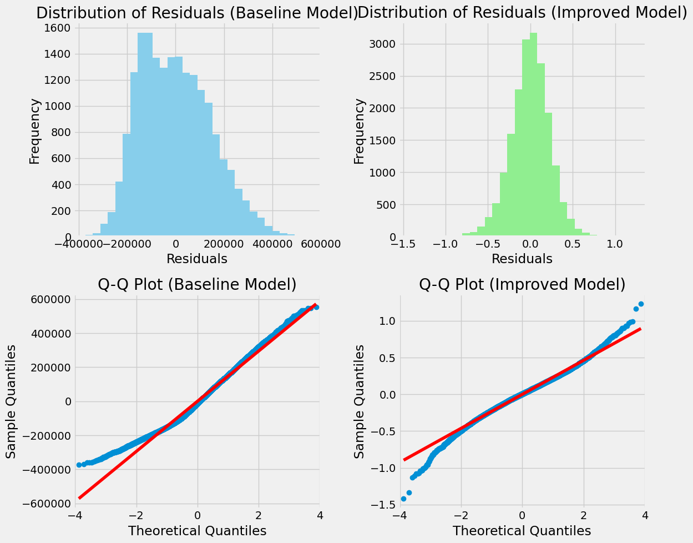
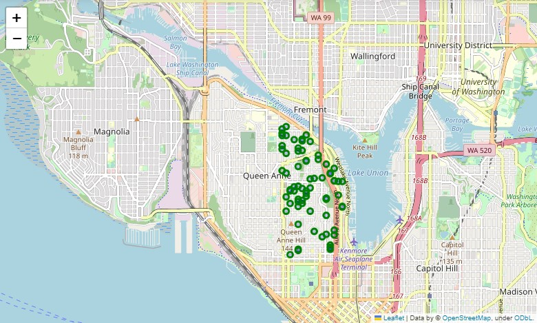
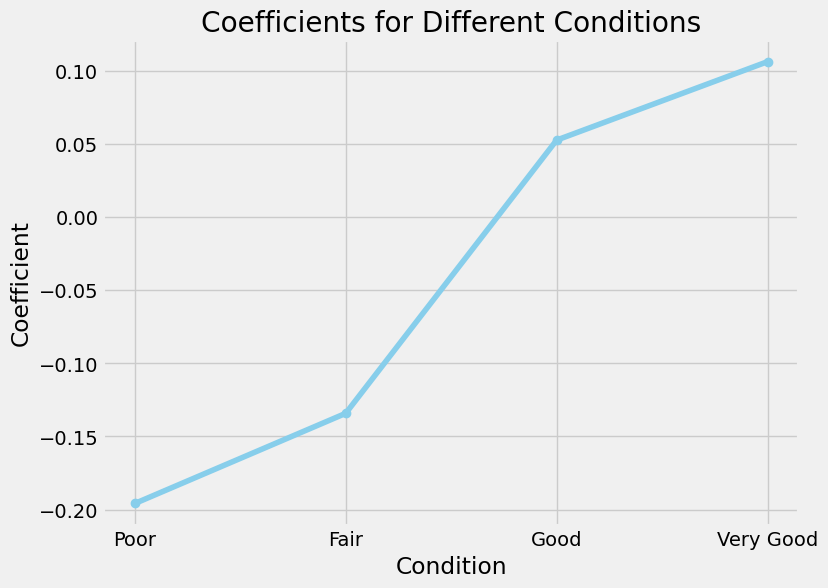
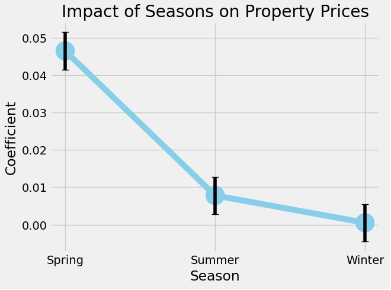

# House Flipping Analysis for DreamFlip Ventures

## Overview

This repository contains an analysis of the King County real estate market aimed at assisting DreamFlip Ventures, a house flipping company, in making informed investment decisions. The analysis utilizes a statistical model to identify key factors that influence property prices and returns on investment. By understanding these factors, DreamFlip Ventures can strategically acquire properties, plan renovations, and optimize the timing of resale.

## Business Understanding
DreamFlip Ventures aims to enter the competitive real estate market in King County. To achieve their goals, they need to assess the profitability and potential returns on investment for properties in the area. The analysis focuses on understanding the factors that impact property values and identifying strategies to maximize returns. By leveraging data-driven insights, DreamFlip Ventures can make informed decisions on property acquisition and renovation, ultimately enhancing their chances of success in the house flipping business.

## Data Understanding
The data used for this analysis is the King County House Sales dataset. The dataset contains information about real estate properties sold in King County, Washington. It includes various attributes such as the number of bedrooms, bathrooms, square footage, condition, grade, location, and sale prices of the properties.

The dataset is sourced from the King County Department of Assessments and is publicly available for analysis. You can access the dataset from the following link: [King County House Sales Dataset](https://www.kingcounty.gov/depts/assessor/Reports/gis-salesresearch.aspx)

The dataset provides valuable insights into the housing market in King County and serves as the foundation for the analysis conducted in this project. The dataset is explored, cleaned, and used to build a regression model to understand the factors influencing property prices and returns on investment.

## Modeling
The analysis employs a statistical model, specifically multiple linear regression, to analyze the relationship between various predictors and property prices. Factors such as location, property condition, and other attributes are considered to identify significant drivers of property value. The model provides insights into the impact of these factors on pricing, allowing DreamFlip Ventures to make data-backed decisions regarding property selection, renovation strategies, and optimal timing for resale.

### Model Performance 

-This shows that the second model did better with the residue being more normaly distributed

## Regression Results
The regression analysis yielded several significant findings:

- Property location, particularly proximity to Lake Union, has a strong positive impact on property prices.

- DreamFlip Ventures can enhance property value by adding one or two bathrooms through strategic renovations. Additionally, investing in houses with poor condition and lower grades offers a lucrative opportunity for increasing market value. By renovating these properties, DreamFlip Ventures can maximize profitability. Thorough market research, property evaluations, and strategic renovations are key to success in the real estate market.

- The model suggests that spring, with its favorable market conditions and increased buyer activity, could be a good season for purchasing properties in Lake Union. However, further analysis and market monitoring are recommended to validate this finding.

## Conclusion
DreamFlip Ventures can leverage the insights from this analysis to make informed investment decisions in the King County real estate market. By focusing on properties in poor condition, particularly in the Lake Union area, they can capitalize on the potential for increasing property values through renovations. Additionally, considering the addition of bathrooms as part of the renovation strategy can further enhance the attractiveness and value of the properties. Timing the acquisitions during the spring season may also offer advantages due to market dynamics.

Continuous market monitoring, thorough property evaluations, and data-driven decision-making are crucial for DreamFlip Ventures to succeed in the competitive house flipping industry. This analysis serves as a foundation for their strategic approach, empowering them to optimize their house flipping projects and maximize profitability in the King County real estate market.

For detailed analysis, data exploration, and modeling code, please refer to the provided student notebook available in the [student notebook](https://github.com/u-mar/Phase-2-Project/blob/main/student.ipynb).

## Presentation Link 
Link:[presentation](https://github.com/u-mar/Phase-2-Project/blob/main/presentation.pdf).

## Repository Structure
├── img
│   ├── bath.png
│   ├── condition.png
│   ├── house_sale.png
├── Data
│   ├── k_house.csv
│   ├── column_info.md
├── .gitignore
├── presentation.pdf
├── README.md
├── student.ipynb

